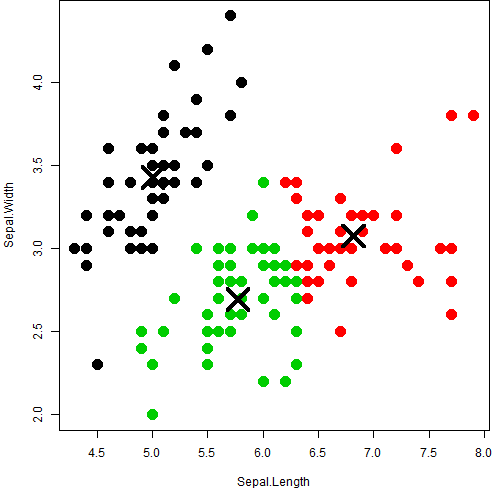

## Introduction

In this Data Science assignment - I used K-Means Clustering example on Iris dataset in R.  I shall brief on:

1.  K-Means Clustering 
2.  Iris dataset
3.  Example of Clustering


---
## K-Means Clustering

K-Means clustering is a method of vector quantization that is quite popular for cluster analysis in data mining. k-means clustering aims to partition 'n' observations into 'k' clusters in which each observation belongs to the cluster with the nearest mean, and results into effective partitioning of the data space into Voronoi cells. The algorithm uses an iterative refinement technique. Due to its ubiquity it is often called the k-means algorithm. The number of clusters 'k' is an input parameter; and Euclidean distance is used as a metric and variance is used as a measure of cluster scatter.  

K-Means has been successfully used in various topics, ranging from market segmentation, computer vision, geostatistics, and astronomy to agriculture. It often is used as a preprocessing step for other algorithms, for example to find a starting configuration.  Typical Applications are:

1. Vector quantization
2. Cluster analysis
3. Feature learning


--- .class #id 

## Iris dataset 

The famous (Fisher's or Anderson's) iris data set gives the measurements in centimeters of the variables sepal length and width and petal length and width, respectively, for 50 flowers from each of 3 species of iris. The species are Iris setosa, versicolor, and virginica.

iris is a data frame with 150 cases (rows) and 5 variables (columns) named Sepal.Length, Sepal.Width, Petal.Length, Petal.Width, and Species.


```r
str(iris)
```

```
## 'data.frame':	150 obs. of  5 variables:
##  $ Sepal.Length: num  5.1 4.9 4.7 4.6 5 5.4 4.6 5 4.4 4.9 ...
##  $ Sepal.Width : num  3.5 3 3.2 3.1 3.6 3.9 3.4 3.4 2.9 3.1 ...
##  $ Petal.Length: num  1.4 1.4 1.3 1.5 1.4 1.7 1.4 1.5 1.4 1.5 ...
##  $ Petal.Width : num  0.2 0.2 0.2 0.2 0.2 0.4 0.3 0.2 0.2 0.1 ...
##  $ Species     : Factor w/ 3 levels "setosa","versicolor",..: 1 1 1 1 1 1 1 1 1 1 ...
```


--- .class #id 

## Example K-Means Classification

Steps:

1. Select 'k' Clusters
2. Select X, Y feature variables


```r
# Specify Cluster
k <- 3
features <- names(iris)

# Select Data
selectedData <- iris[, c(features[1], features[2])]
clusters <- kmeans(selectedData, k)
```


```r
# Plot (See on next Pag)
par(mar = c(5.1, 4.1, 0, 1))
plot(selectedData, col = clusters$cluster, pch = 20, cex = 3)
points(clusters$centers, pch = 4, cex = 4, lwd = 4)
```

 


---

## Example K-Means Classification Plot

 

